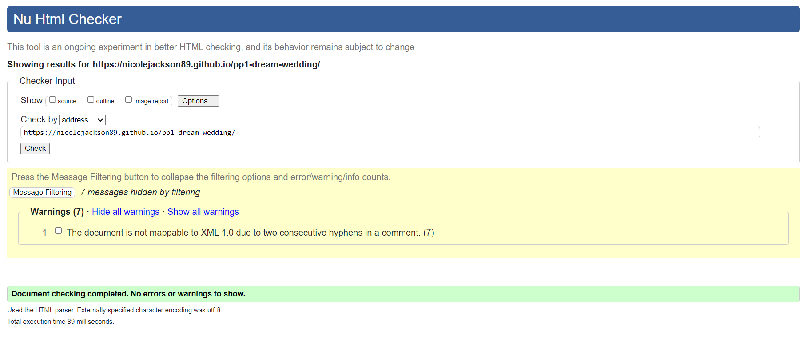
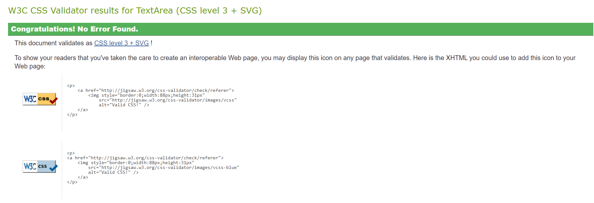
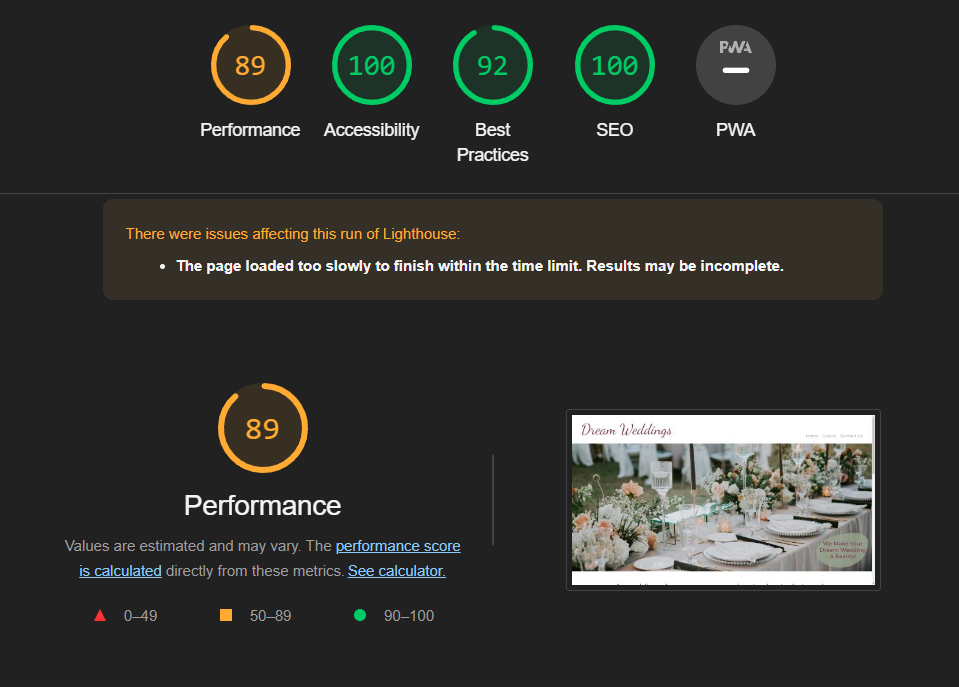
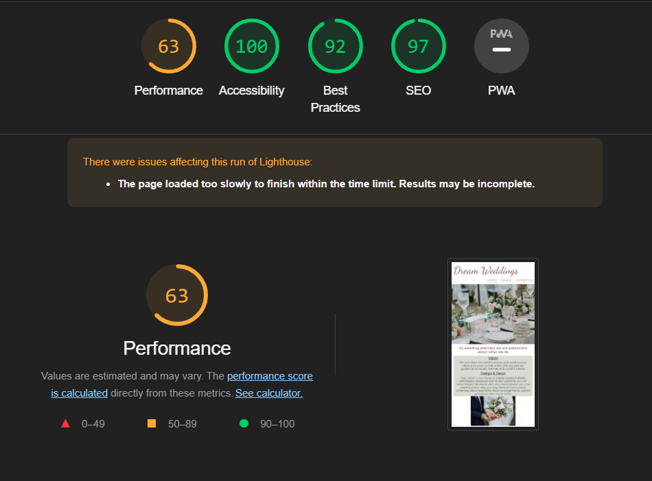

# Dream Weddings

## [View the website here](https://nicolejackson89.github.io/pp1-dream-wedding/)

As a service provider, Dream weddings was created to showcase what we as wedding planners can do for couples who plan to get married in the near future.

The site is directly targered to engaged couples who require assistance with thier overall wedding planning needs. A gallery was added to provide a visual guide for the types of possible wedding themes and previous weddings created by us.

## User Experience

### Strategy

### Scope

### Structure

### Skeleton

### Surface

## Features

This website was designed on desktop view first as I thought this would be the most likely way users will search for the services of a wedding planner.

### Existing Features

- Logo and Navigation Bar

  - Both the Logo and Nav Bar were styled inline for a easy flow to the page.

- Logo

  - The logo is fully responsive. No matter which page your are on in the website, by clikcing on the logo you will be redirected back to the Home page.
  - Animation was added to the logo with a zoom-in effect as an eye catching experience for users.

- Navigation Bar
  
  - The nav bar is featured on all three pages of the website with links to the Home, Gallery and Contact Us pages.
  - Users will easily navigate to these pages using any device without having to make use of the back button on the browser.
  - The links on the nav bar have been styled with underline and higher opacity, this will allow users to know which page they are currently in.

- Landing page image

  - The landing page image is of a wedding reception table decorated by Wedding Planners, show casing to the user some of the beautiful work we do.
  - An intoduction of how we can create a users dream wedding if they make use of our services is also included in the bottom corner of this image.

- What we offer Section

  - In this section the user can read about what we offer as a service provider. The user will see that our goal is to understand thier vision, preferences and budget for thier wedding and that we work around them.
  - Two images have been used on either side of the content for a softer more appealing view.
  - On smaller screen sizes the images will display below each content box for ease of reading.
  - This short but descriptive section should leave the user feeling encouraged to contact us

- Who we are section

  - In this section we introduce ourselves by making use of an image of our team.
  - The user will see we have over 10 years of expereance in the field, this will leave the user feeling content with leaving the hard work of planning thier wedding in our hands.
  - A casual, well thought photograph was used for a playful, hands-on work space feel.

- Footer

  - The footer has links to our social media pages, these will open up in a new tab tor ease of navigation for users.
  - Company contact details have been added to the footer as I have taken into consideration that some users may want to get straight into contacting us rather than search for the details in another page.
  - The social media links have added animation that will increase in size when the user hovers over either of them.

- Gallery

  - The gallery has been added to provide users with supporting images of our work.
  - The border radius was intentional to create a softer, welcoming look to the images.
  - Images in the gallery would be of value to users as they would be a deciding factor of whether or not to contact us to provide a service to them.
  - I have taken smaller screens into consideration, the gallery become smaller with the number of columns when screen sizes decrease.

- Contact Us page

  - The contact us page includes a heading letting users know turn around time once teh form has been submitted. A short quote has been added to the bottom of the section.
  - Our contact details and address using a Google maps link has been added as a feature for users to easily locate us.
  - The enquiry form is for users who wish to be contacted back, they will be required to enter their names, email address and wedding date with the option to enter other details.
  - Features added to the form will be on the 'send' button where this has been highlighted in a different color when hovered over.

- Thank you page

  - The user will be redirected to a 'Thank you' page after submitting the form.
  - For the ease of navigation an interactive link to the home page has been added with a font awesome icon and animation to match the social media links in the footer.

### Future Features

- Taking into consideration that clients from different locations in the country / world may want to make use of our services, we may add virtual assistance with a bookings and payment page. These will also have links to a skype, Google meets or Teams meetings with clients.
- A review section where past clients can add there experience with us for possible future clients to see.
- A video gallery can be added for users to enjoy a 3D view of our work.

## Testing

- HTML and CSS code was tested throught the building process of this web page using the W3C validator to fix any errors or warnings. This was to ensure a smoother final testing period at the end of the building process.

### HTML Validator

- All of the HTML pages were passed through the official [W3C HTML validator](https://validator.w3.org/) no errors were found.
- A warning has come up for the Gallery HTML page, a section was used without a heading. This was fixed by replacing the section element with a div element.
- Other warnings have come up due to the usage of two or more consectutive hyphens used in comments, I made a concise desicion to leave these as they help with code location on the pages.

### CSS Validator

- No errors were found when validating my CSS code through the official [W3C CSS validator](https://jigsaw.w3.org/css-validator/).
- A warning has come back for my Google fonts import, I made a concise decision to leave this as it does not affect the overall website. The warning is a notification that the validator will not validate my imported Google font.
- Other warnings have come up due to the usage of two or more consectutive hyphens used in comments, I made a concise desicion to leave these as they help with code location on the pages.

### Lighthouse

I used the Lighthouse Google Chrome dev tools feature to test the wedsite in mobile and desktop view. 

- Desktop

  - The performance score was affected here due to the Home page images being a larger property size.

- Mobile

  - A lower performance score was received on the mobile testing, this was due to my home page images being a larger property size. 

### Manual Testing

|What was tested|Result|
|---|---|
|Social media links in the footer - Open in a new tab in the browser|Passed|
|Three navigation links in the header - Redirect to the correct pages|Passed|
|Enquire form - Required fields message shown|Passed|
|Enquire form submision - Redirected to the 'Thank you' page|Passed|

### Known bugs and fixes

|What was tested / Expected results|Actual Results|What was done to fix the bug|
|---|---|---|
|Page Logo - To stay within the parent div while animation is active|Overflow when the animation zoom is active|Changed the animation fill mode from both to forward only|
|Margins in media queries for smaller screen sizes - Page content should be readable|Content overflow from the container div|Margins were reduced and display flex used where needed|
|Run Gallery HTML code through the W3C validator|Section element lacking a heading element|Section element changed to a div element|
|HTML Code for 'contact us' page through the HTML Validator|Error - p elements may not be a child of an h2 elements|p elements removed from h2 elements and listed below the h2 element|

## Deployment

### GitHub deployment

### Cloning the GitHub repository

### Forking the GitHub repository

## Technologies Used

- [HTML](https://en.wikipedia.org/wiki/HTML)
  - HTML was used to structure the content of the web page
- [CSS](https://en.wikipedia.org/wiki/CSS)
  - CSS was used to style the content of the web page
- [Google Fonts](https://fonts.google.com/)
  - Google Fonts was used to style the font thtoughout the web page
- [Chrome DevTools](https://developer.chrome.com/docs/devtools/)
  - DevTools was used throughout the process of creating the web page to find bugs and test responsivness on elements etc.
- [Font Awesome](https://fontawesome.com/)
  - Font awesome was used for social media icons in the footer and thank you page
- [TinyPNG](https://tinypng.com/)
  - TinyPNG was used to resize the images in the Gallery for fatter laoding time
- [Codeanywhere](https://codeanywhere.com/)
  - Codeanywhere was used as the development environment for this web page
- [GitHub](https://github.com/)
  - GitHud is being used to store the code for this web page
- [Color Contrast Accessibility Validator](https://color.a11y.com/)
  - Color Contrast Validator was used to test the web pages color contrast
- [W3C Markup Validation](https://validator.w3.org/)
  - W3C validator was used to validate all the HTML code in the web page
- [W3C CSS Validation](https://jigsaw.w3.org/css-validator/)
  - W3C validator was used to validate all the CSS code in the web page
- [Free Formatter](https://www.freeformatter.com/)
  - Free formatter was used to format the CSS and HTML code throughout the web page
- [Am I Responsive?](https://ui.dev/amiresponsive)
  - Used to for the image in the README file

## Credits

### Media

### Content
