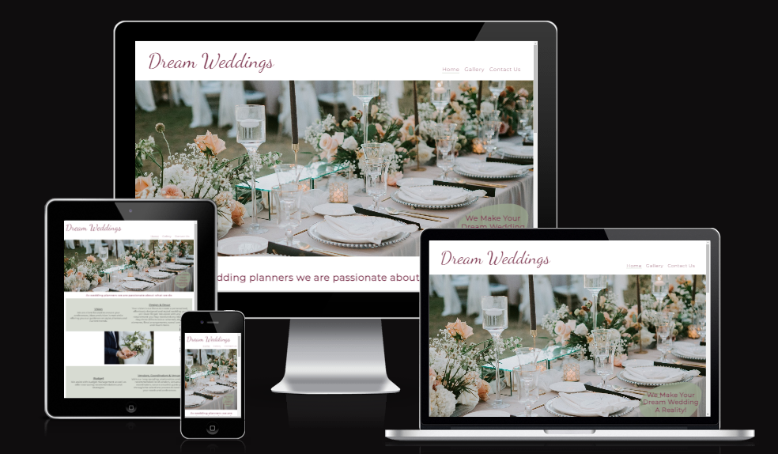
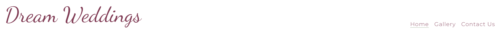
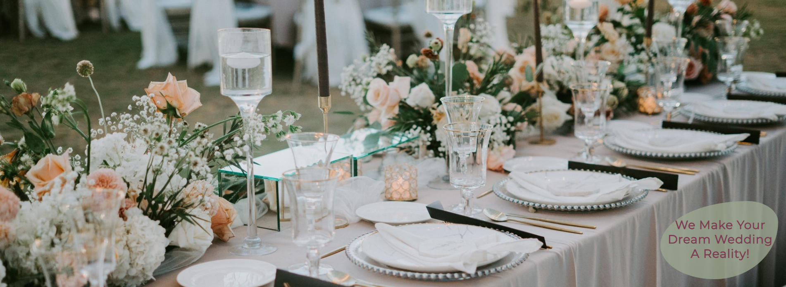
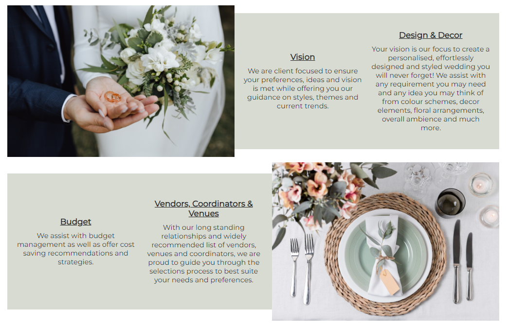
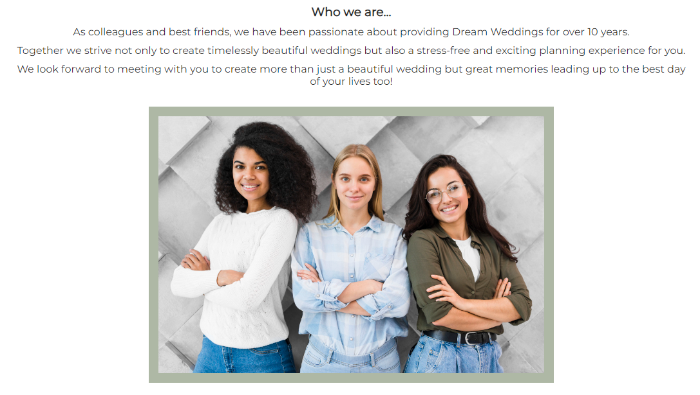
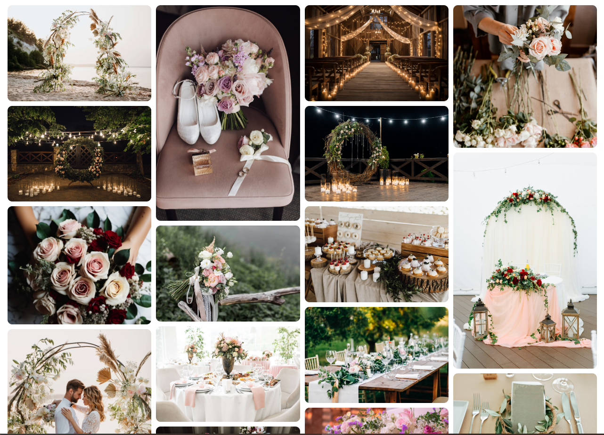
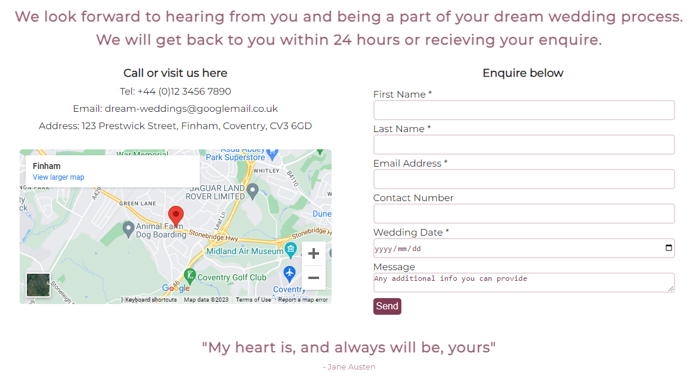
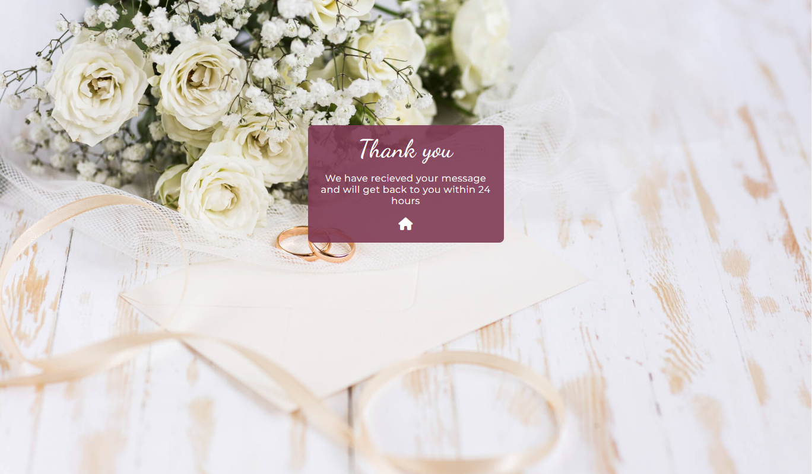

# Dream Weddings

## [View the website here](https://nicolejackson89.github.io/pp1-dream-wedding/)

As a service provider, Dream weddings was created to showcase what we as wedding planners can do for couples who plan to get married in the near future.

The site is directly targered to engaged couples who require assistance with thier overall wedding planning needs. A gallery was added to provide a visual guide for the types of possible wedding themes and previous weddings created by us.

## User Experience

### Strategy

### Scope

### Structure

### Skeleton

### Surface

## Features

This website was designed on desktop view first as I thought this would be the most likely way users will search for the services of a wedding planner.

### Existing Features

- Logo and Navigation Bar

  - Both the Logo and Nav Bar were styled inline for a easy flow to the page.

- Logo

  - The logo is fully responsive. No matter which page your are on in the website, by clikcing on the logo you will be redirected back to the Home page.
  - Animation was added to the logo with a zoom-in effect as an eye catching experience for users.

- Navigation Bar
  
  - The nav bar is featured on all three pages of the website with links to the Home, Gallery and Contact Us pages.
  - Users will easily navigate to these pages using any device without having to make use of the back button on the browser.
  - The links on the nav bar have been styled with underline and higher opacity, this will allow users to know which page they are currently in.

- Landing page image

  - The landing page image is of a wedding reception table decorated by Wedding Planners, show casing to the user some of the beautiful work we do.
  - An intoduction of how we can create a users dream wedding if they make use of our services is also included in the bottom corner of this image.

- What we offer Section

  - In this section the user can read about what we offer as a service provider. The user will see that our goal is to understand thier vision, preferences and budget for thier wedding and that we work around them.
  - Two images have been used on either side of the content for a softer more appealing view.
  - On smaller screen sizes the images will display below each content box for ease of reading.
  - This short but descriptive section should leave the user feeling encouraged to contact us

- Who we are section

  - In this section we introduce ourselves by making use of an image of our team.
  - The user will see we have over 10 years of expereance in the field, this will leave the user feeling content with leaving the hard work of planning thier wedding in our hands.
  - A casual, well thought photograph was used for a playful, hands-on work space feel.

- Footer

  - The footer has links to our social media pages, these will open up in a new tab tor ease of navigation for users.
  - Company contact details have been added to the footer as I have taken into consideration that some users may want to get straight into contacting us rather than search for the details in another page.
  - The social media links have added animation that will increase in size when the user hovers over either of them.

- Gallery

  - The gallery has been added to provide users with supporting images of our work.
  - The border radius was intentional to create a softer, welcoming look to the images.
  - Images in the gallery would be of value to users as they would be a deciding factor of whether or not to contact us to provide a service to them.
  - I have taken smaller screens into consideration, the gallery become smaller with the number of columns when screen sizes decrease.

- Contact Us page

  - The contact us page includes a heading letting users know turn around time once teh form has been submitted. A short quote has been added to the bottom of the section.
  - Our contact details and address using a Google maps link has been added as a feature for users to easily locate us.
  - The enquiry form is for users who wish to be contacted back, they will be required to enter their names, email address and wedding date with the option to enter other details.
  - Features added to the form will be on the 'send' button where this has been highlighted in a different color when hovered over.

- Thank you page

  - The user will be redirected to a 'Thank you' page after submitting the form.
  - For the ease of navigation an interactive link to the home page has been added with a font awesome icon and animation to match the social media links in the footer.

### Future Features

- Taking into consideration that clients from different locations in the country / world may want to make use of our services, we may add virtual assistance with a bookings and payment page. These will also have links to a skype, Google meets or Teams meetings with clients.
- A review section where past clients can add there experience with us for possible future clients to see.
- A video gallery can be added for users to enjoy a 3D view of our work. 

## Technologies Used

## Testing

### HTML Validator

### CSS Validator

### Lighthouse

### Manual Testing

### Known bugs and fixes

## Deployment

### GitHub deployment

### Cloning the GitHub repository

### Forking the GitHub repository

## Credits

### Media

### Content
